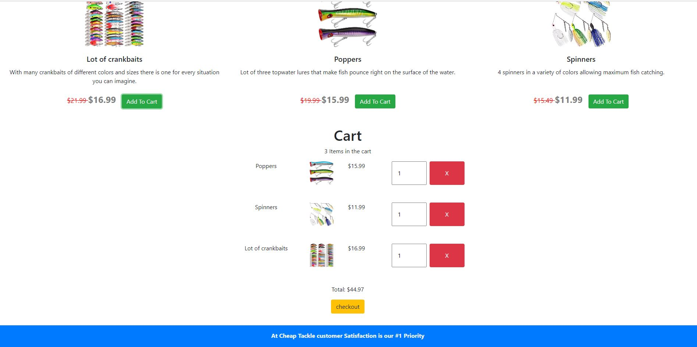
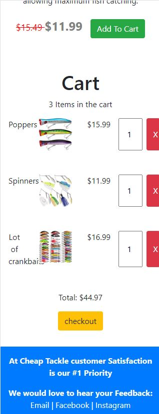

# Cheap-Tackle
Simple single page store for fishing tackle using a simple cart system. The purpose of this project is
to build a simple, responsive and functional frontend of a store that is pleasing to look at and use.

## Live Deployment
https://jacobm2000.github.io/Cheap-Tackle

## Screenshots

### Desktop

### Mobile

